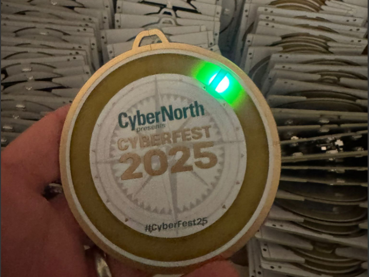
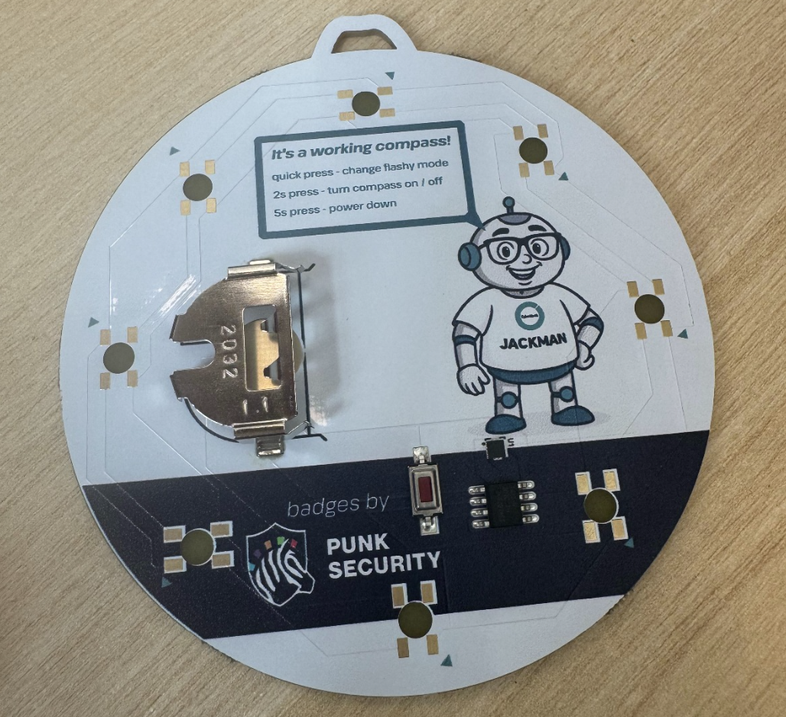

# This is the repo for the CyberNorth CyberFest badge

**This badge was given out at CyberFest conference to all attendees, and had a compass mode so you can always find your way North**

This badge uses UV full colour silk, and we ordered them from JLCPCB using EasyEDA. The PCB was built first with AutoCAD EAGLE, then exported, and imported into EasyEDA by JLCPCB for design updates. We have provided the EasyEDA exports in case you want to import and tweak the designs, or you can order your own as-is using the gerber files :)

Unlike almost all of our other badges, we ordered these partialy assembled. This means that JLCPCB placed some parts for us. We did this as the 3-axis magnometer (which does the compass reading) was tiny and needed a super tiny capacitor too!

Lots of things in this repo:

- EAGLE.brd: The AutoCAD Eagle board design
- EAGLE.sch - The AutoCAD Eagle circuit schematic
- cyberfest-2025.epro - The EasyEDA export, including the front art
- gerber.zip: the file you can upload to JLCPCB and order your own badge, as is
- firmware.ino: the arduino code that powers the badge, which you can modify and flash via the SAO connector

## Bill Of Materials

We sourced some parts direct from JLCPCB, so you may need to tweak footprints when ordering direct. The most notable difference is the coin cell battery clasp, which has smaller "foot" pads. The one provided by JLC was awful and we would recommend replacing it.

Essentially its:

* ATTINY412 microcontroller
* Button - any surface mount button fitting the footprint will work
* CR2032 battery clip  - surface mount not through hole
* Neopixel 5050 addressable LED - Definitely get the right version of these
* LIS2MDLTR - a 3-axis magnetometer (the compass)

## How does it work?

The badge does the usually blinky modes, but also provides a north bearing. To do this, we read the magentic readings from a 3-axis magnometer (LIS2MDLTR)

Compass reading is difficult, as the enviroment is full of intereference. We need to calibrate our readings, so when compass mode is activated we take continous readings for a few seconds. During this time, you should rotate the badge a few times. 

You'll see lots of really tricky code in this repo around compass bearings. Essentially turning magentic readings into a bearing is difficult, and the math to do it takes a lot of flash space. More flash space then we have available actually, so we had to do some funky coding to get a near-enough reading. Our resolution is one of 8 LEDS, so it's a fair trade off!

The current build uses 4082 of 4096 bytes of flash!

## Ordering your own badge

We've uploaded the AutoCAD EAGLE schematic and board design!  You will probably have to do some tweaks to get it working as they're not designed to be standalone exports.

This is then exported to EasyEDA to add the colour print to the boards. The file for that is already in the repo, so you can skip the EAGLE step if you prefer.

We've also uploaded the gerber.zip.  Take this to JLCPCB and you can order your own exact copies of the board :)

## Writing and flashing code!

We use [MegaTinyCore](https://github.com/SpenceKonde/megaTinyCore) for the arduino interface for ATTINY4x2 chips.

Dev and flashing is done within the Arduino IDE ( < v2 ) using a jtag2updi interface, as discussed [here](https://github.com/SpenceKonde/AVR-Guidance/blob/master/UPDI/jtag2updi.md)

We use [these little usb sticks](https://amzn.eu/d/c0lx0wG), with a 4.7k resistor soldered between the Tx and Rx lines.  

### Installing MegaTinyCore dependencies

This board package can be installed via the board manager in arduino. The boards manager URL is:

`http://drazzy.com/package_drazzy.com_index.json`

1. File -> Preferences, enter the above URL in "Additional Boards Manager URLs"
2. Tools -> Boards -> Boards Manager...
3. Wait while the list loads (takes longer than one would expect, and refreshes several times).
4. Select "megaTinyCore by Spence Konde" and click "Install". For best results, choose the most recent version.

### Setting up the IDE

1. Open the file **firmware.ino** in arduino
2. Select tools > Board > megaTinyCore > ATtiny412/402/212/202
3. Select tools > Chip > ATtiny412
4. Select tools > Clock > 16Mhz internal *(we get power issues otherwise)*
5. Select tools > millis > Disabled
5. Select tools > Programmer > SerialUPDI SLOW
6. Select tools > Port > ( pick your COM port)

### Flashing firmware
1. Connect the 3v3 pin to 3v on your usb (maybe wedge it in the battery clip)
2. Connect GND to GND
3. Connect UPDI to the RxD port
4. Click Upload button

## How to solder?

Make sure to line up the dot on the attiny412 with the dot on the board.

*It's much easier if you hold the component in place with one hand, and then solder one pad. Now you can solder the rest of the pads with one hand*

